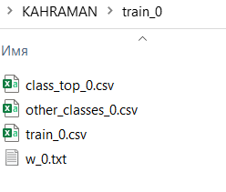

# 0 Установка и импорт библиотеки
1. Для установки библиотеки необходимо в терминале ввести следующую команду:
```
pip install widelearning
```
Также необходимо установить дополнительные библиотеки:
```
pip install numpy
```
```
pip install pandas
```
```
pip install requests
```
Для сверточного слоя необходимо установить библиотеку TensorFlow:
```
pip install tensorflow
```
Дальнейшие действия выполнены в Jupyter Notebook. Устанавливается с помощью команды:
```
pip install jupyter
```
Запуск Jupyter Notebook выполняется с помощью команды:
```
jupyter notebook
```
2. Импорт библиотеки:
```
import widelearning as wdl
```
# 1 Полносвязный слой
1. Подготовка набора данных (датасета).
Для примера использован набор данных User Knowledge Modeling Data Set, который можно скачать по адресу: 
[User Knowledge Modeling Data Set](https://archive.ics.uci.edu/ml/datasets/User+Knowledge+Modeling)

Открытый в MS Excel файл выглядит следующим образом:


Скопируем часть, содержащую данные, в новый файл формата csv и переместим столбец UNS (состоит из меток принадлежности к классам) в начало. Заменим разделитель целой и дробной части вместо запятой «,» на точку «.». Также необходимо разделитель столбцов поменять с «;» на «,». Иногда данные в csv файле могут быть после преобразований заключены в двойные кавычки. Необходимо также удалить из итогового файла этот знак.
Получившийся файл, открытый в текстовом редакторе:


2. Преобразование в целочисленный вид
Для выполнения вычислений преобразуем с помощью функции data_int представленные в вещественнозначном виде данные в целочисленный. Создадим файл dec.txt, который содержит количество знаков после запятой для каждого столбца файла csv. Значения количества знаков в файле txt идут на новой строке для каждого следующего столбца, то есть в нашем случае имеется 5 столбцов, для каждого столбца количество знаков равно 2. В итоге в файле dec.txt 5 строк со значением 2:


Первый параметр функции – путь к подготовленной выборке в формате csv, второй параметр – файл со значениями количества знаков после запятой для каждого столбца, третий параметр – желаемое название выходных преобразованных в целочисленный вид файлов.
```
wdl.data_int('kahraman.csv', 'dec.txt', 'KAHRAMAN') 
```


В результате применения функции data_int получим целочисленные обучающую и тестовую выборки:


3. Первоначальное приближение первого нейрона
Используем функцию select_top для получения первоначального приближения первого нейрона:
```
wdl.select_top('KAHRAMAN_train.csv', 'UNS')
```
Здесь первый параметр – путь к обучающей выборке в целочисленном виде, второй параметр – название столбца с метками классов.
Вывод функции выглядит следующим образом:
```
Количество отсеченных сверху =  9
Количество НЕотсеченных сверху =  14
Количество отсеченных снизу =  8
Количество НЕотсеченных снизу =  201
===Нижняя категория:  High
СУММА отсеченных сверху и снизу =  17
TOP -  ['very_low']
OTHERS -  ['High', 'Low', 'Middle']
+++++++++++++++++++++++++
Количество отсеченных сверху =  10
Количество НЕотсеченных сверху =  44
Количество отсеченных снизу =  15
Количество НЕотсеченных снизу =  163
===Нижняя категория:  very_low
СУММА отсеченных сверху и снизу =  25
TOP -  ['High']
OTHERS -  ['very_low', 'Low', 'Middle']
+++++++++++++++++++++++++
Количество отсеченных сверху =  4
Количество НЕотсеченных сверху =  71
Количество отсеченных снизу =  7
Количество НЕотсеченных снизу =  150
===Нижняя категория:  High
СУММА отсеченных сверху и снизу =  11
TOP -  ['Low']
OTHERS -  ['very_low', 'High', 'Middle']
+++++++++++++++++++++++++
Количество отсеченных сверху =  0
Количество НЕотсеченных сверху =  80
Количество отсеченных снизу =  7
Количество НЕотсеченных снизу =  145
===Нижняя категория:  Low
СУММА отсеченных сверху и снизу =  7
TOP -  ['Middle']
OTHERS -  ['very_low', 'High', 'Low']
+++++++++++++++++++++++++
```
Переменная TOP обозначает целевой класс и соответсвенно, «Нижняя категория» - это противоположный класс, участвующий в отсечении.
Были также сгенерированы папки:


Необходимо выбрать целевой класс. Выбор можно производить по разным критериям: 
* по сумме отсеченных сверху и снизу;
* по количеству отсеченных сверху;
* по количеству отсеченных снизу и так далее.

От выбора целевого класса зависит итоговая структура нейронной сети. В нашем случае целевой класс будет выбираться по сумме отсеченных экземпляров сверху и снизу. Таким образом, в качестве целевого на первом нейроне выступает класс «High», поскольку сумма отсеченных равна 25. Если мы хотим оставить полученные результаты без проведения градиентного уточнения вектора весов, то необходимо открыть соответствующую папку и скопировать в отдельный каталог файлы w.txt и train.csv, которые являются вектором весов первого нейрона и сокращенной выборкой для второго нейрона:


4. Градиентное уточнение первого нейрона
С помощью градиентного уточнения можно увеличить количество отсеченных экземпляров. Функция grad изменяет элементы вектора весов после первоначального приближения с некоторым шагом и фиксирует количество отсеченных. В приоритете стоит количество отсеченных сверху (требуется увеличение количества), далее количество отсеченных снизу (требуется увеличение количества), на последнем месте расстояние между границами отсечения. Если количество отсеченных сверху и снизу не изменяется, то элемент вектора изменяется, пока расстояние между границами уменьшается.

Первый параметр функции grad – путь к обучающей выборке, которая использовалась в первоначальном приближении, второй – целевой класс, третий – список с остальными классами, четвертый – название столбца с метками классов, пятый – шаг градиентного уточнения, шестой – вектор весов после первоначального приближения. Вектор весов берется из соответствующей целевому классу папки первоначального приближения (файл w.txt).
```
wdl.grad('KAHRAMAN_train.csv', ['High'], ['very_low', 'Low', 'Middle'], 'UNS', 1, [455.02247191011236, 552.8764044943821, 273.38202247191015, 518.2921348314607, 2276.179775280899])
```
В результате градиентного уточнения сгенерировались папки train_{i}.csv. 


Необходимо проверить каждую из них и выбрать ту папку, в которой в файле txt во второй строке (количество отсеченных сверху) наибольшее значение. Если значения одинаковые, то необходимо проверить третью строку (количество отсеченных снизу) и выбрать ту папку, в которой данное значение наибольшее. В случае одинаковых значений сверху и снизу, необходимо выбирать папку по последней строке файла txt, которое обозначает расстояние между границами, оно должно быть минимальное.

Таким образом, в нашем случае все три значения для всех папок одинаковые, поэтому выбирается любая. Выберем папку под номером 0. Необходимо скопировать отдельно файл train.csv и w.txt. Первый файл является сокращенной обучающей выборкой для второго нейрона, второй файл – является вектором весов первого нейрона.



После градиентного уточнения количество отсеченных экземпляров увеличилось: сверху до 49, снизу до 10.

5. Первоначальное приближение второго нейрона
Выбирается сокращенная выборка после градиентного уточнения:
```
wdl.select_top('train_2.csv', 'UNS')
```
```
Количество отсеченных сверху =  1
Количество НЕотсеченных сверху =  4
Количество отсеченных снизу =  3
Количество НЕотсеченных снизу =  165
===Нижняя категория:  Low
СУММА отсеченных сверху и снизу =  4
TOP -  ['High']
OTHERS -  ['Middle', 'Low', 'very_low']
+++++++++++++++++++++++++
Количество отсеченных сверху =  5
Количество НЕотсеченных сверху =  75
Количество отсеченных снизу =  6
Количество НЕотсеченных снизу =  87
===Нижняя категория:  Low
СУММА отсеченных сверху и снизу =  11
TOP -  ['Middle']
OTHERS -  ['High', 'Low', 'very_low']
+++++++++++++++++++++++++
Количество отсеченных сверху =  7
Количество НЕотсеченных сверху =  68
Количество отсеченных снизу =  4
Количество НЕотсеченных снизу =  94
===Нижняя категория:  Middle
СУММА отсеченных сверху и снизу =  11
TOP -  ['Low']
OTHERS -  ['High', 'Middle', 'very_low']
+++++++++++++++++++++++++
Количество отсеченных сверху =  1
Количество НЕотсеченных сверху =  12
Количество отсеченных снизу =  1
Количество НЕотсеченных снизу =  159
===Нижняя категория:  Middle
СУММА отсеченных сверху и снизу =  2
TOP -  ['very_low']
OTHERS -  ['High', 'Middle', 'Low']
+++++++++++++++++++++++++
```
Имеется два класса с количеством отсеченных экземпляров сверху и снизу, равным 11. Выберем в качестве целевого класс «Low».

6. Градиентное уточнение второго нейрона
Из соответствующей папки, в названии которой в первом списке «Low», копируем вектор весов. 
```
wdl.grad('train_2.csv', ['Low'], ['High', 'Middle', 'very_low'], 'UNS', 1, [-540.3163265306123, -194.17346938775518, -400.48979591836735, 1046.591836734694, -1941.0408163265306])
```
Выбираем из папок train номер папки, в которой в файле txt наибольшее количество отсеченных сверху, иначе наибольшее количество отсеченных снизу, иначе наименьшее расстояние между границами отсечения. Во всех папках одинаковые значения, выберем папку 1. Количество отсеченных сверху стало 10, снизу 7. Скопируем в отдельный каталог файл train.csv и w.txt (сокращенная обучающая выборка третьего нейрона, вектор весов второго нейрона). Удалим сгенерированные папки.

7. Первоначальное приближение третьего нейрона
Загрузим соответствующую сокращенную выборку:
```
wdl.select_top('train_3.csv', 'UNS')
```
```
Количество отсеченных сверху =  1
Количество НЕотсеченных сверху =  64
Количество отсеченных снизу =  1
Количество НЕотсеченных снизу =  90
===Нижняя категория:  High
СУММА отсеченных сверху и снизу =  2
TOP -  ['Low']
OTHERS -  ['very_low', 'Middle', 'High']
+++++++++++++++++++++++++
Количество отсеченных сверху =  4
Количество НЕотсеченных сверху =  9
Количество отсеченных снизу =  1
Количество НЕотсеченных снизу =  142
===Нижняя категория:  Middle
СУММА отсеченных сверху и снизу =  5
TOP -  ['very_low']
OTHERS -  ['Low', 'Middle', 'High']
+++++++++++++++++++++++++
Количество отсеченных сверху =  1
Количество НЕотсеченных сверху =  72
Количество отсеченных снизу =  2
Количество НЕотсеченных снизу =  81
===Нижняя категория:  very_low
СУММА отсеченных сверху и снизу =  3
TOP -  ['Middle']
OTHERS -  ['Low', 'very_low', 'High']
+++++++++++++++++++++++++
Количество отсеченных сверху =  1
Количество НЕотсеченных сверху =  4
Количество отсеченных снизу =  2
Количество НЕотсеченных снизу =  149
===Нижняя категория:  Low
СУММА отсеченных сверху и снизу =  3
TOP -  ['High']
OTHERS -  ['Low', 'very_low', 'Middle']
+++++++++++++++++++++++++
```
Наибольшая сумма отсеченных равна 5 для целевого класса «very_low».

8. Градиентное уточнение третьего нейрона
```
wdl.grad('train_3.csv', ['very_low'], ['Low', 'Middle', 'High'], 'UNS', 1, [47.81818181818181, -182.63636363636363, -141.54545454545456, 91.72727272727275, -387.27272727272725])
```
В папке под номером 0 расстояние минимальное и равно 7.34. Из данной папки копируются в отдельный каталог файлы train.csv и w.txt (обучающая выборка для четвертого нейрона и вектор весов третьего нейрона). Сгенерированные папки необходимо удалить.

9. Первоначальное приближение четвертого нейрона
В качестве целевого выбирается класс «High», поскольку сумма отсеченных наибольшая и равна 4.
```
wdl.select_top('train_4.csv', 'UNS')
```
```
Количество отсеченных сверху =  0
Количество НЕотсеченных сверху =  7
Количество отсеченных снизу =  1
Количество НЕотсеченных снизу =  141
===Нижняя категория:  High
СУММА отсеченных сверху и снизу =  1
TOP -  ['very_low']
OTHERS -  ['Low', 'Middle', 'High']
+++++++++++++++++++++++++
Количество отсеченных сверху =  1
Количество НЕотсеченных сверху =  64
Количество отсеченных снизу =  2
Количество НЕотсеченных снизу =  82
===Нижняя категория:  High
СУММА отсеченных сверху и снизу =  3
TOP -  ['Low']
OTHERS -  ['very_low', 'Middle', 'High']
+++++++++++++++++++++++++
Количество отсеченных сверху =  0
Количество НЕотсеченных сверху =  72
Количество отсеченных снизу =  1
Количество НЕотсеченных снизу =  76
===Нижняя категория:  Low
СУММА отсеченных сверху и снизу =  1
TOP -  ['Middle']
OTHERS -  ['very_low', 'Low', 'High']
+++++++++++++++++++++++++
Количество отсеченных сверху =  2
Количество НЕотсеченных сверху =  3
Количество отсеченных снизу =  2
Количество НЕотсеченных снизу =  142
===Нижняя категория:  Low
СУММА отсеченных сверху и снизу =  4
TOP -  ['High']
OTHERS -  ['very_low', 'Low', 'Middle']
+++++++++++++++++++++++++
```
10. Градиентное уточнение четвертого нейрона
```
wdl.grad('train_4.csv', ['High'], ['very_low', 'Low', 'Middle'], 'UNS', 1, [-63.5625, 75.15972222222223, -44.30555555555556, -83.38888888888889, 196.91666666666666])
```
Вектор весов и сокращенная обучающая выборка копируются из папки №3. Количество отсеченных сверху 5, снизу – 2, расстояние – 751.9. Класс «High» полностью отсекся.

Удаляются сгенерированные папки.

11. Первоначальное приближение пятого нейрона
```
wdl.select_top('train_5.csv', 'UNS')
```
```
Количество отсеченных сверху =  52
Количество НЕотсеченных сверху =  20
Количество отсеченных снизу =  1
Количество НЕотсеченных снизу =  69
===Нижняя категория:  Low
СУММА отсеченных сверху и снизу =  53
TOP -  ['Middle']
OTHERS -  ['Low', 'very_low']
+++++++++++++++++++++++++
Количество отсеченных сверху =  1
Количество НЕотсеченных сверху =  62
Количество отсеченных снизу =  60
Количество НЕотсеченных снизу =  19
===Нижняя категория:  Middle
СУММА отсеченных сверху и снизу =  61
TOP -  ['Low']
OTHERS -  ['Middle', 'very_low']
+++++++++++++++++++++++++
Количество отсеченных сверху =  0
Количество НЕотсеченных сверху =  7
Количество отсеченных снизу =  54
Количество НЕотсеченных снизу =  81
===Нижняя категория:  Middle
СУММА отсеченных сверху и снизу =  54
TOP -  ['very_low']
OTHERS -  ['Middle', 'Low']
+++++++++++++++++++++++++
```
Целевым выбирается класс «Middle», поскольку несмотря на сумму отсеченных сверху отсекается только один экземпляр. Предпочтительнее выбрать вариант, в котором сверху отсекается большее количество экземпляров.

12. Градиентное уточнение пятого нейрона
```
wdl.grad('train_5.csv', ['Middle'], ['Low', 'very_low'], 'UNS', 1, [277.4000000000001, 201.71428571428555, 150.99999999999994, -709.5714285714286, 2071.085714285714])
```
В результате класс «very_low» полностью отсекся.

Выберем папку под номером 0. Скопируем в отдельный каталог выборку для шестого нейрона train.csv и вектор весов пятого нейрона w.txt. Удалим сгенерированные папки.

13. Первоначальное приближение шестого нейрона
В обучающей выборке осталось только два класса. Количество экземпляров выборки равно 64. Необходимо использовать бинарные варианты функций с меткой «binary».
```
wdl.select_top_binary('train_6.csv', 'UNS')
```
```
Количество отсеченных сверху =  18
Количество отсеченных снизу =  45
===Верхняя категория:  Low
===Нижняя категория:  Low
TOP -  ['Middle']
OTHER -  ['Low']
СУММА отсеченных сверху и снизу =  63
[-929.5079365079366, -696.952380952381, -46.03174603174604, -108.99999999999997, -1315.1269841269843]
DISTANCE =  342.9047619047633
+++++++++++++++++++++++++++++++++++++++

Количество отсеченных сверху =  57
Количество отсеченных снизу =  6
===Верхняя категория:  Low
===Нижняя категория:  Low
TOP -  ['Low']
OTHER -  ['Middle']
СУММА отсеченных сверху и снизу =  63
[1009.0, 48.0, -929.0, -1056.0, -13.0]
DISTANCE =  205.0
+++++++++++++++++++++++++++++++++++++++
```
Выберем в качестве целевого класс «Low». Он полностью отсекся. В выборке остался только один экземпляр класса «Middle». Градиентное уточнение в данном случае уже не нужно.

Необходимо скопировать вектор весов из соответствующего файла:


14. Проверка результатов
В папку data переместим обучающие выборки для каждого нейрона. В папку weights соответствующие вектора весов. Принцип наименования должен соответствовать следующему виду:


Полученные веса сначала необходимо масштабировать в диапазон от -1 до 1 с помощью функции scale_weights, в которой первый параметр – это название столбца с метками классов, второй параметр – путь к папке, содержащей обучающие выборки, третий параметр – путь к папке, содержащей веса для каждого нейрона.
```
wdl.scale_weights('UNS', 'data/', 'weights/')
```
В результате дополнительно сгенерировались папки «scale», «result» и «all_weights». Папка «all_weights» содержит специальный текстовый файл, содержащий отмасштабированные веса всех нейронов. Данный файл необходим для функции check_test. Функция check_test позволяет проверить точность вычислений полученной структуры нейронной сети.

Первый параметр – путь к обучающей выборке, второй параметр – путь к текстовому файлу weights.txt, третий параметр – путь к тестовой выборке, четвертый параметр – название столбца с метками классов.
```
wdl.check_test('KAHRAMAN_train.csv', 'all_weights/weights.txt', 'KAHRAMAN_test.csv', 'UNS')
```
Таким образом имеется две ошибки на тестовой выборке (экземпляры № 3 и 160).


Если третьим параметром передать путь к обучающей выборке, то будет определена точность по обучающей выборке:
```
wdl.check_test('KAHRAMAN_train.csv', 'all_weights/weights.txt', 'KAHRAMAN_train.csv', 'UNS')
```


Для генерации функции логического вывода можно применить функцию generate_fa:
```
wdl.generate_fa('UNS', 'result', 'scale')
```


Здесь первый параметр – название столбца с метками классов, второй параметр – путь к папке result, содержащей вычисления скалярного произведения для каждой из обучающих выборок, третий параметр – путь к папке scale – в которой содержатся в отдельных файлах отмасштабированные веса каждого нейрона.

# 2 Сверточный слой


